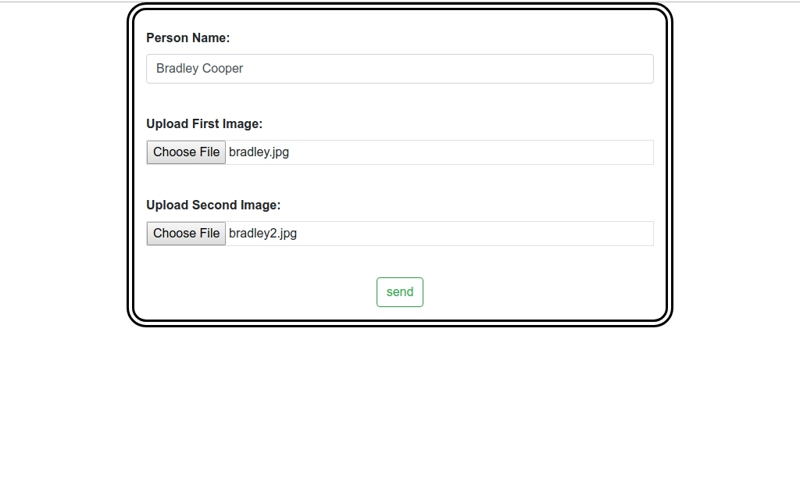

# Computer-Vision-Projects

### Çalıştırmak için:

Uygulamaya **app.py** dosyasını çalıştırdıktan sonra **"localhost:5000"** adresinden erişebilirsiniz.

#**Port çakışması** yaşarsanız:**app.py** dosyasındaki kod bloğunu istediğiniz port numarası ile değiştirebilirsiniz. 
`if __name__ == "__main__":` 
    `app.run(port=4555, debug=True)`

**"First Image:"** için aranan kişinin profil resmini yüklemeniz gerekir.

**"Second Image:"** için aranacak kişinin içinde olduğu bir resim yükleyebilirsiniz.

**"Sonuç:"**

###Gerekli kütüphaneler
 1-Python 3.7.3
